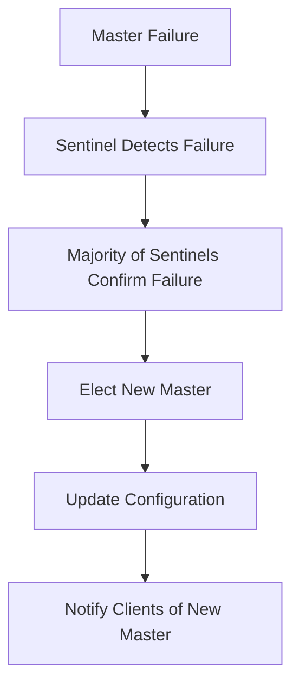

# Redis High Availability Architecture

## Architecture Overview

This new Redis high availability architecture uses **Redis Sentinel mode** to achieve true high availability, replacing the previous problematic multi-replica deployment.

## Architecture Components

### 1. Redis Master (1 instance)
- **StatefulSet**: `redis-master`
- **Replicas**: 1
- **Purpose**: Handle all write operations
- **Persistence**: Data persistence provided through PVC

### 2. Redis Slaves (2 instances)
- **StatefulSet**: `redis-slave`
- **Replicas**: 2
- **Purpose**: 
  - Synchronize data from Master
  - Handle read operations
  - Can be promoted to new Master when Master fails

### 3. Redis Sentinel (3 instances)
- **Deployment**: `redis-sentinel`
- **Replicas**: 3
- **Purpose**:
  - Monitor health status of Master and Slaves
  - Automatic failure detection and failover
  - Configuration management and service discovery

## Failover Process



## Service Endpoints

### Application Connection Methods
1. **Connect via Sentinel** (Recommended):
   - Service: `redis-sentinel:26379`
   - Clients automatically discover current Master through Sentinel

2. **Direct Connection** (Not recommended for production):
   - Master: `redis-master-0.redis-master:6379`
   - Slaves: `redis-slave-0.redis-slave:6379`, `redis-slave-1.redis-slave:6379`

## Application Configuration Examples

### Python (redis-py-sentinel)
```python
from redis.sentinel import Sentinel

sentinel = Sentinel([('redis-sentinel', 26379)])
master = sentinel.master_for('mymaster', socket_timeout=0.1)
slave = sentinel.slave_for('mymaster', socket_timeout=0.1)

# Write operations
master.set('key', 'value')

# Read operations
value = slave.get('key')
```

### Java (Lettuce)
```java
RedisURI sentinelUri = RedisURI.Builder
    .sentinel("redis-sentinel", 26379, "mymaster")
    .build();

RedisClient client = RedisClient.create(sentinelUri);
```

## Environment-Specific Configuration

### Staging Environment
- **Master**: 1 instance, 256Mi-2Gi memory
- **Slaves**: 2 instances, 256Mi-2Gi memory  
- **Sentinel**: 3 instances, 64Mi-128Mi memory

### Production Environment
- Higher resource limits can be configured through the same kustomization structure
- Recommended to increase PVC size and memory limits

## Monitoring and Maintenance

### Check Cluster Status
```bash
# Connect to Sentinel to check status
kubectl exec -it deployment/redis-sentinel -- redis-cli -p 26379

# Sentinel commands
SENTINEL masters
SENTINEL slaves mymaster
SENTINEL sentinels mymaster
```

### Manual Failover
```bash
# Execute in Sentinel
SENTINEL failover mymaster
```

## Migration Considerations

1. **Data Migration**: If migrating from old single-instance deployment, ensure data is properly migrated
2. **Application Updates**: Applications need to support Redis Sentinel clients
3. **Configuration Updates**: Update application Redis connection configuration

## Advantages

✅ **True High Availability**: Automatic failover when Master fails  
✅ **Data Consistency**: Master-slave replication ensures data consistency  
✅ **Read-Write Separation**: Read operations can be distributed to Slaves  
✅ **Automatic Recovery**: Failure recovery without manual intervention  
✅ **Service Discovery**: Clients automatically discover current Master